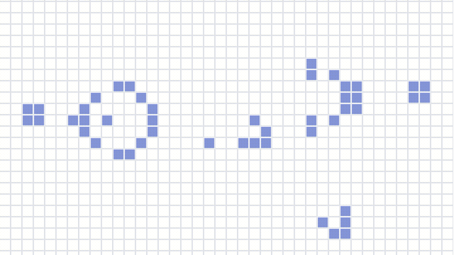

# Conway's Game of Life

Conway's Game of Life built with React and TypeScript. This is a zero-player game that models underpopulation, overpopulation, and reproduction using a grid of cells. The cells are either alive or dead. The state of each cell is determined by the states of its neighbors.

## Screenshot



## Installation with npm

```bash
npm install
npm start

npm run build
```
